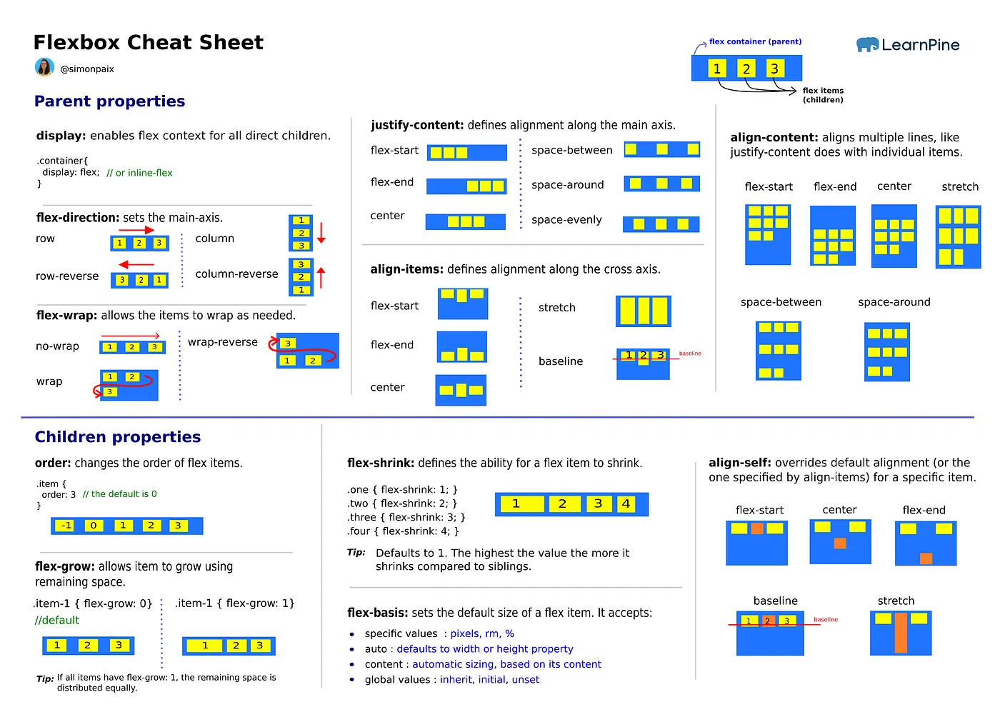

Perfect 👌 Let’s make clear and structured notes for those three points:

---

# 📘 Flexbox Basics — Notes

### 1️⃣ What is Flexbox?

- **Flexbox (Flexible Box Layout)** is a CSS layout module.
- It is designed to arrange elements in **one dimension** (either **row** = horizontal OR **column** = vertical).
- It makes it easier to:

  - Align items (left, right, center, top, bottom)
  - Distribute space between items
  - Handle **responsive layouts** (items adjust size automatically)

- Key idea: Instead of manually calculating widths/margins, Flexbox handles alignment and spacing dynamically.

---

### 2️⃣ Difference between Flex Container and Flex Items

- **Flex Container**

  - The parent element where `display: flex` (or `inline-flex`) is applied.
  - It controls the **flow, direction, and alignment** of its children.
  - Properties like `flex-direction`, `justify-content`, `align-items` apply **only to the container**.

- **Flex Items**

  - The **direct children** of a flex container.
  - They automatically become flexible and follow the rules set by the container.
  - Individual items can be controlled using properties like `order`, `flex-grow`, `flex-shrink`, `flex-basis`, `align-self`.

👉 Think of it like this:

- Container = "Boss" (decides how employees line up)
- Items = "Employees" (can follow boss’s rules or have their own overrides).

---

### 3️⃣ Declaring a Flex Container

To activate Flexbox, you must declare a flex container:

- **`display: flex;`**

  - Makes the element a block-level flex container (takes full width).
  - Example:

    ```css
    .container {
    	display: flex;
    }
    ```

- **`display: inline-flex;`**

  - Makes the element an inline-level flex container (fits in line with text/other elements).
  - Example:

    ```css
    .inline-container {
    	display: inline-flex;
    }
    ```

👉 Difference:

- `flex` → behaves like a block element.
- `inline-flex` → behaves like an inline element.

---

⚡ Quick Example:

```html
<div class="container">
	<div>Item 1</div>
	<div>Item 2</div>
	<div>Item 3</div>
</div>

<style>
	.container {
		display: flex; /* Or inline-flex */
		border: 2px solid black;
	}
</style>
```

---

Do you want me to also draw a **diagram (with ASCII/visual sketch)** showing how container vs items behave in `flex` vs `inline-flex`?

Great request 👍 Let’s make **detailed notes** on **Flex Container Properties**, with simple explanations **+ visual sketches** so you can remember them clearly.

---

# 📘 Flex Container Properties

These properties are applied **to the parent (container)**, and they control **how child flex items behave**.

---

## 🔹 1. `flex-direction`

Defines the **main axis** (the direction flex items are placed).

- `row` → Default. Items go **left → right**.
- `row-reverse` → Items go **right → left**.
- `column` → Items go **top → bottom**.
- `column-reverse` → Items go **bottom → top**.

**Example:**

```css
.container {
	display: flex;
	flex-direction: row; /* try row, row-reverse, column, column-reverse */
}
```

**Visual:**

```
row            : [1] [2] [3]
row-reverse    : [3] [2] [1]
column         : [1]
                  [2]
                  [3]
column-reverse : [3]
                  [2]
                  [1]
```

---

## 🔹 2. `flex-wrap`

Controls whether items **wrap to the next line** when there’s not enough space.

- `nowrap` (default) → All items stay in **one line** (may shrink).
- `wrap` → Items move to the **next line** if they don’t fit.
- `wrap-reverse` → Items wrap to the next line **but in reverse order (bottom → top)**.

**Example:**

```css
.container {
	display: flex;
	flex-wrap: wrap;
}
```

**Visual:**

```
nowrap      : [1][2][3][4][5][6]   (all squeezed into one line)
wrap        : [1][2][3]
              [4][5][6]            (new line starts below)
wrap-reverse: [4][5][6]
              [1][2][3]            (new line starts above)
```

---

## 🔹 3. `flex-flow`

A **shorthand** for `flex-direction` + `flex-wrap`.

**Syntax:**

```css
flex-flow: <flex-direction> <flex-wrap>;
```

**Example:**

```css
.container {
	display: flex;
	flex-flow: row wrap; /* same as flex-direction: row + flex-wrap: wrap */
}
```

---

## 🔹 4. `justify-content`

Aligns items along the **main axis** (horizontal in `row`, vertical in `column`).

- `flex-start` → Items packed at **start**.
- `flex-end` → Items packed at **end**.
- `center` → Items in the **center**.
- `space-between` → First at start, last at end, equal space between.
- `space-around` → Equal space around items (half-space at edges).
- `space-evenly` → Equal space **between and at edges**.

**Example:**

```css
.container {
	display: flex;
	justify-content: space-between;
}
```

**Visual:**

```
flex-start   : [1][2][3]
flex-end     :             [1][2][3]
center       :      [1][2][3]
space-between: [1]     [2]     [3]
space-around :   [1]   [2]   [3]
space-evenly :    [1]    [2]    [3]
```

---

## 🔹 5. `align-items`

Aligns items along the **cross axis** (perpendicular to main axis).

- `flex-start` → Align at **top** (if row).
- `flex-end` → Align at **bottom**.
- `center` → Align in the **middle**.
- `stretch` (default) → Items stretch to fill container height.
- `baseline` → Align according to **text baseline**.

**Example:**

```css
.container {
	display: flex;
	align-items: center;
}
```

**Visual (row direction, tall container):**

```
flex-start   : [1]   [2]   [3]   (top)
flex-end     : [1]   [2]   [3]   (bottom)
center       : [1]   [2]   [3]   (middle)
stretch      : [1]   [2]   [3]   (all stretched)
baseline     : [1]   [2]   [3]   (align text baselines)
```

---

## 🔹 6. `align-content`

Controls spacing **between multiple rows** (only works if wrapping happens).
Think of it like `justify-content` but for the **cross axis**.

- `flex-start` → Rows packed at the **top**.
- `flex-end` → Rows packed at the **bottom**.
- `center` → Rows in the **middle**.
- `stretch` → Rows stretch to fill space.
- `space-between` → First row at top, last row at bottom, even spacing in between.
- `space-around` → Equal spacing **around each row**.

**Example:**

```css
.container {
	display: flex;
	flex-wrap: wrap;
	align-content: space-between;
}
```

**Visual (2 rows of items):**

```
flex-start   : Row1
               Row2
flex-end     :               Row1
                              Row2
center       :       Row1
               Row2
stretch      : Row1 (stretched)
               Row2 (stretched)
space-between: Row1
               (space)
               Row2
space-around :   Row1
               (space)
               Row2
```

---

✅ That covers all **container properties** with examples + sketches.

👉 Do you want me to also prepare a **single comparison table** (like a cheat sheet) with all these properties and their possible values side by side for quick revision?

Perfect 👍 Let’s make detailed notes on **Flex Item Properties** with explanations + simple visual examples (like we did for the container).

---

# 📘 Flex Item Properties

These properties apply to **individual flex items** (the **children** of a flex container).

---

## 🔹 1. `order`

- Defines the **visual order** of flex items, independent of their HTML order.
- Default value = `0`.
- Items with **lower order values appear first**.

**Example:**

```css
.item1 {
	order: 2;
}
.item2 {
	order: 1;
}
.item3 {
	order: 3;
}
```

**Visual:**

```
Default order: [1][2][3]
With order   : [2][1][3]   (because item2 has smallest order)
```

---

## 🔹 2. `flex-grow`

- Controls how much an item can **grow** when there’s **extra space** in the container.
- Default = `0` (item will not grow).
- If all items have different `flex-grow`, the extra space is distributed **proportionally**.

**Example:**

```css
.item1 {
	flex-grow: 1;
}
.item2 {
	flex-grow: 2;
}
.item3 {
	flex-grow: 1;
}
```

**Visual (extra space distributed):**

```
Item2 grows 2x compared to Item1 and Item3:
[1]   [2        ]   [3]
```

---

## 🔹 3. `flex-shrink`

- Controls how much an item can **shrink** when there’s **not enough space**.
- Default = `1` (all items shrink equally).
- If set to `0`, the item will **not shrink**.

**Example:**

```css
.item1 {
	flex-shrink: 0;
} /* won’t shrink */
.item2 {
	flex-shrink: 2;
} /* shrinks faster */
.item3 {
	flex-shrink: 1;
}
```

**Visual (when space is tight):**

```
Item2 shrinks 2x faster:
[1] [22][3]
```

---

## 🔹 4. `flex-basis`

- Defines the **initial size** of an item **before grow/shrink rules apply**.
- Can be set in px, %, em, etc.
- Default = `auto` (size depends on content or width property).

**Example:**

```css
.item1 {
	flex-basis: 100px;
}
.item2 {
	flex-basis: 200px;
}
.item3 {
	flex-basis: 50px;
}
```

**Visual (starting widths):**

```
[1----][2--------][3-]
```

---

## 🔹 5. `flex` (shorthand)

- Shorthand for → `flex-grow flex-shrink flex-basis`.
- Syntax: `flex: <grow> <shrink> <basis>`
- Common patterns:

  - `flex: 1;` → means `flex: 1 1 0` (grow, shrink, basis=0).
  - `flex: auto;` → means `flex: 1 1 auto`.
  - `flex: none;` → means `flex: 0 0 auto`.

**Example:**

```css
.item1 {
	flex: 1;
} /* grows equally */
.item2 {
	flex: 2;
} /* grows twice as much */
.item3 {
	flex: 1 0 100px;
} /* grow=1, shrink=0, basis=100px */
```

**Visual:**

```
With flex: 1,2,1
[1] [2        ] [3]
```

---

## 🔹 6. `align-self`

- Overrides the container’s `align-items` for a **specific item**.
- Values: `auto` (default, follows container), `flex-start`, `flex-end`, `center`, `baseline`, `stretch`.

**Example:**

```css
.container {
	align-items: center;
}
.item1 {
	align-self: flex-start;
}
.item2 {
	align-self: flex-end;
}
```

**Visual (row direction):**

```
Container center alignment:    [1] [2] [3]
With align-self:              [1(top)] [2(bottom)] [3(center)]
```

---

✅ Summary:

- `order` → changes position.
- `flex-grow` → expands when space is free.
- `flex-shrink` → contracts when space is tight.
- `flex-basis` → sets starting size.
- `flex` → shorthand for the 3 above.
- `align-self` → overrides alignment for one item.

---

👉 Do you want me to also make a **real HTML+CSS demo snippet** that you can run in your browser to see all these properties in action?

Great question 🙌 These 4 properties often confuse people because they sound similar. Let’s break them down **clearly, with examples and side-by-side comparisons**.

---

# 📘 Flexbox & Grid Alignment Properties

⚠️ First thing:

- **Flexbox** mainly uses → `justify-content`, `align-items`, `align-content`
- **Grid** introduces → `justify-items` (and also has `align-items`, `justify-content`, `align-content`)

So, **`justify-items` doesn’t apply in flexbox** (only in CSS Grid).

---

## 🔹 1. `justify-content`

- Works in: **Flexbox + Grid**
- Controls **how items as a group are placed along the main axis** (horizontal in `flex-direction: row`, vertical in `flex-direction: column`).

**Example (flex row):**

```css
.container {
	display: flex;
	justify-content: space-between;
}
```

**Visual:**

```
flex-start   : [1][2][3]
flex-end     :          [1][2][3]
center       :     [1][2][3]
space-between: [1]     [2]     [3]
space-around :   [1]   [2]   [3]
space-evenly :    [1]    [2]    [3]
```

👉 **Think:** "How do all items as a group sit on the main axis?"

---

## 🔹 2. `justify-items`

- Works in: **Grid only** (ignored in flexbox).
- Controls **how each individual item is aligned within its own grid cell along the inline (row) axis**.

**Example (grid):**

```css
.container {
	display: grid;
	grid-template-columns: repeat(3, 100px);
	justify-items: center;
}
```

**Visual (3 cells, items inside each cell):**

```
start   : [1   ][2   ][3   ]
center  : [ 1  ][ 2  ][ 3  ]
end     : [   1][   2][   3]
stretch : [1---][2---][3---] (default, fills cell)
```

👉 **Think:** "Inside its own cell, where does each item sit?"

---

## 🔹 3. `align-items`

- Works in: **Flexbox + Grid**
- Controls **how items are aligned along the cross axis** (perpendicular to main axis).
- Applies to all items unless overridden by `align-self`.

**Example (flex row, tall container):**

```css
.container {
	display: flex;
	align-items: center;
}
```

**Visual (vertical alignment in a row container):**

```
flex-start: [1] [2] [3]   (top)
flex-end  : [1] [2] [3]   (bottom)
center    : [1] [2] [3]   (middle)
stretch   : [1] [2] [3]   (all stretched)
baseline  : [1] [2] [3]   (aligned by text baseline)
```

👉 **Think:** "How do items sit vertically (cross axis)?"

---

## 🔹 4. `align-content`

- Works in: **Flexbox + Grid**
- Only affects **multi-line layouts** (when wrapping in flexbox OR multiple rows in grid).
- Controls **spacing between rows** along the cross axis.

**Example (flex wrap with 2 rows):**

```css
.container {
	display: flex;
	flex-wrap: wrap;
	align-content: space-between;
}
```

**Visual (cross axis spacing):**

```
flex-start   : Row1
               Row2
flex-end     :       Row1
                       Row2
center       :   Row1
               Row2
space-between: Row1
               (space)
               Row2
space-around :   Row1
               (space)
               Row2
stretch      : Row1 (stretched)
               Row2 (stretched)
```

👉 **Think:** "If there are multiple rows, how should the rows themselves be spaced?"

---

# 🔍 Side-by-Side Quick Comparison

| Property            | Works in    | Axis              | Applies to             | Example Use                                   |
| ------------------- | ----------- | ----------------- | ---------------------- | --------------------------------------------- |
| **justify-content** | Flex + Grid | Main axis         | Whole group            | Distribute items horizontally in a nav bar    |
| **justify-items**   | Grid only   | Inline axis (row) | Each item in its cell  | Center content inside grid cells              |
| **align-items**     | Flex + Grid | Cross axis        | All items in container | Vertically center items in a row              |
| **align-content**   | Flex + Grid | Cross axis        | Rows as a group        | Control spacing between multiple wrapped rows |

---

✅ TL;DR:

- **justify-content** = _items as a group along main axis_
- **justify-items** = _each item inside its own cell (Grid only)_
- **align-items** = _all items along cross axis_
- **align-content** = _rows/groups along cross axis_

---

👉 Do you want me to prepare a **single HTML+CSS demo** showing all 4 in action (with Flexbox + Grid), so you can run and see the differences live?
