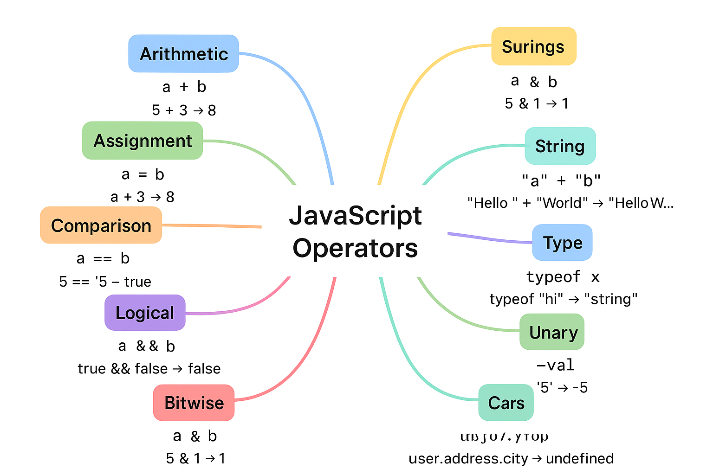

Perfect ✅
Here’s a **roadmap-style table** for all important **JavaScript Operators** with **syntax + examples** (like a revision cheat sheet).

---

# 📘 JavaScript Operators – Roadmap with Examples

| **Category**          | **Operator**   | **Syntax**            | **Example**            | **Result**                  |     |     |        |     |         |        |
| --------------------- | -------------- | --------------------- | ---------------------- | --------------------------- | --- | --- | ------ | --- | ------- | ------ |
| **Arithmetic**        | `+` (add)      | `a + b`               | `5 + 3`                | `8`                         |     |     |        |     |         |        |
|                       | `-` (subtract) | `a - b`               | `5 - 3`                | `2`                         |     |     |        |     |         |        |
|                       | `*` (multiply) | `a * b`               | `5 * 3`                | `15`                        |     |     |        |     |         |        |
|                       | `/` (divide)   | `a / b`               | `10 / 2`               | `5`                         |     |     |        |     |         |        |
|                       | `%` (modulus)  | `a % b`               | `10 % 3`               | `1`                         |     |     |        |     |         |        |
|                       | `**` (power)   | `a ** b`              | `2 ** 3`               | `8`                         |     |     |        |     |         |        |
|                       | `++` (inc)     | `++a` or `a++`        | `let a=5; ++a;`        | `6`                         |     |     |        |     |         |        |
|                       | `--` (dec)     | `--a` or `a--`        | `let a=5; a--;`        | `4`                         |     |     |        |     |         |        |
| **Assignment**        | `=`            | `a = b`               | `a = 10`               | `10`                        |     |     |        |     |         |        |
|                       | `+=`           | `a += b`              | `a=5; a+=3;`           | `8`                         |     |     |        |     |         |        |
|                       | `-=`           | `a -= b`              | `a=5; a-=2;`           | `3`                         |     |     |        |     |         |        |
|                       | `*=`           | `a *= b`              | `a=4; a*=2;`           | `8`                         |     |     |        |     |         |        |
|                       | `/=`           | `a /= b`              | `a=10; a/=2;`          | `5`                         |     |     |        |     |         |        |
|                       | `%=`           | `a %= b`              | `a=10; a%=3;`          | `1`                         |     |     |        |     |         |        |
| **Comparison**        | `==`           | `a == b`              | `5 == "5"`             | `true`                      |     |     |        |     |         |        |
|                       | `===`          | `a === b`             | `5 === "5"`            | `false`                     |     |     |        |     |         |        |
|                       | `!=`           | `a != b`              | `5 != "5"`             | `false`                     |     |     |        |     |         |        |
|                       | `!==`          | `a !== b`             | `5 !== "5"`            | `true`                      |     |     |        |     |         |        |
|                       | `>`            | `a > b`               | `5 > 3`                | `true`                      |     |     |        |     |         |        |
|                       | `<`            | `a < b`               | `5 < 3`                | `false`                     |     |     |        |     |         |        |
|                       | `>=`           | `a >= b`              | `5 >= 5`               | `true`                      |     |     |        |     |         |        |
|                       | `<=`           | `a <= b`              | `5 <= 3`               | `false`                     |     |     |        |     |         |        |
|                       | `?:` (ternary) | `cond ? x : y`        | `5>3 ? "yes":"no"`     | `"yes"`                     |     |     |        |     |         |        |
| **Logical**           | `&&` (AND)     | `a && b`              | `true && false`        | `false`                     |     |     |        |     |         |        |
|                       | \`             |                       | \` (OR)                | \`a                         |     | b\` | \`true |     | false\` | `true` |
|                       | `!` (NOT)      | `!a`                  | `!true`                | `false`                     |     |     |        |     |         |        |
|                       | `??` (nullish) | `a ?? b`              | `null ?? "default"`    | `"default"`                 |     |     |        |     |         |        |
| **Bitwise**           | `&`            | `a & b`               | `5 & 1`                | `1`                         |     |     |        |     |         |        |
|                       | \`             | \`                    | `a \| b`               | `5 \| 1`                    | `5` |     |        |     |         |        |
|                       | `^`            | `a ^ b`               | `5 ^ 1`                | `4`                         |     |     |        |     |         |        |
|                       | `~`            | `~a`                  | `~5`                   | `-6`                        |     |     |        |     |         |        |
|                       | `<<`           | `a << b`              | `5 << 1`               | `10`                        |     |     |        |     |         |        |
|                       | `>>`           | `a >> b`              | `5 >> 1`               | `2`                         |     |     |        |     |         |        |
|                       | `>>>`          | `a >>> b`             | `-5 >>> 1`             | Large positive number       |     |     |        |     |         |        |
| **String**            | `+` (concat)   | `"a"+"b"`             | `"Hello " + "World"`   | `"Hello World"`             |     |     |        |     |         |        |
|                       | `+=`           | `str += "x"`          | `let s="hi"; s+=" JS"` | `"hi JS"`                   |     |     |        |     |         |        |
| **Type**              | `typeof`       | `typeof x`            | `typeof "hi"`          | `"string"`                  |     |     |        |     |         |        |
|                       | `instanceof`   | `obj instanceof Ctor` | `[] instanceof Array`  | `true`                      |     |     |        |     |         |        |
| **Unary**             | `delete`       | `delete obj.prop`     | `delete user.age`      | removes property            |     |     |        |     |         |        |
|                       | `void`         | `void expr`           | `void(0)`              | `undefined`                 |     |     |        |     |         |        |
|                       | Unary `+`      | `+val`                | `+"5"`                 | `5`                         |     |     |        |     |         |        |
|                       | Unary `-`      | `-val`                | `-"5"`                 | `-5`                        |     |     |        |     |         |        |
| **Spread / Rest**     | Spread         | `...arr`              | `[1,2,...[3,4]]`       | `[1,2,3,4]`                 |     |     |        |     |         |        |
|                       | Rest           | `(...args)`           | `function f(...n){}`   | collects args               |     |     |        |     |         |        |
| **Optional Chaining** | `?.`           | `obj?.prop`           | `user?.address?.city`  | `undefined` (if not exists) |     |     |        |     |         |        |

---

⚡ **Revision Pointers**

- Always remember: `===` is safer than `==`
- `||` returns first _truthy_ value, `??` returns first _non-nullish_ value
- Pre vs Post increment matters in expressions (`++x` vs `x++`)
- Operator precedence affects evaluation order

---

